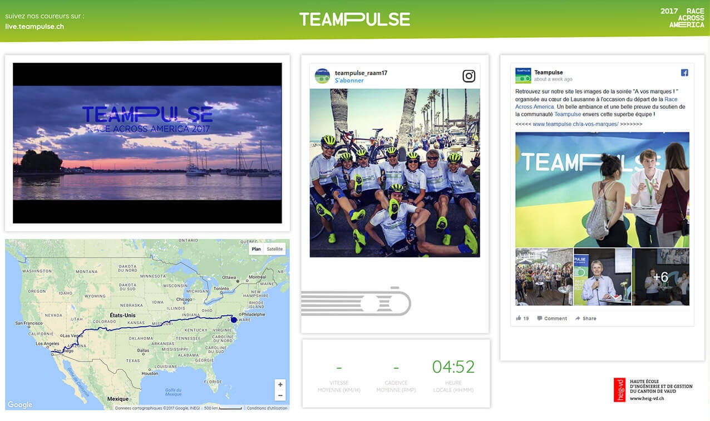

# Teampulse Public Dashboard

The dashboard is intended to use during the Race Across America 2017. It gather informations from all the Social media used by the [swiss Teampulse team](http://www.teampulse.ch): Youtube, Facebook, Instagram, Flickr

Embeds are used instead of raw API to provide a seamless display of the posts regardless of the post content (which can be really different one from another)

## Feature section 'A la une'

One section of the dashboard can be customised with either:
* A Flickr photoset
* A (live) Youtube video
* A Youtube playlist
* A (live) Facebook video

## 2 Design: TV & Scroll

The system can be used on a Full HD TV with [https://teampulse.netlify.com/tv](https://teampulse.netlify.com/tv) or on desktop/mobile: [https://teampulse.netlify.com/](https://teampulse.netlify.com/)

## Enhancement

* Improve structure
* Improve CSS organisation
